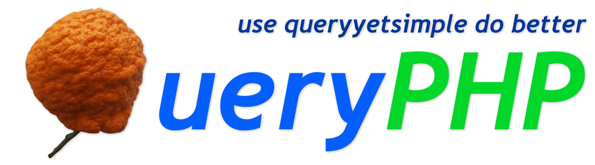
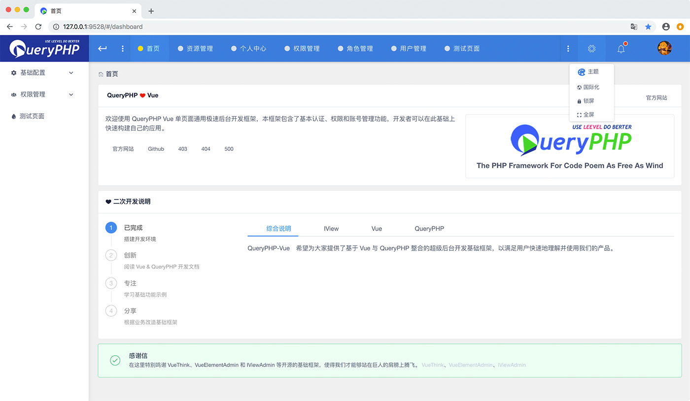

<p align="center">
  <a href="https://queryphp.com">
    
  </a>
</p>

<p align="center">
  <a href="https://php.net"></a>
  <a href="https://www.swoole.com/"></a>
  <a href="https://github.com/spiral/roadrunner"></a>
  <a href="https://github.styleci.io/repos/78216574"></a>
  <a href='https://www.queryphp.com/docs/'></a>
  <br />
  <a href="https://travis-ci.org/hunzhiwange/queryphp">
    </a>
  <a href='https://coveralls.io/github/hunzhiwange/queryphp?branch=master'></a>
  <a href='https://coveralls.io/github/hunzhiwange/framework?branch=master'></a>
  <a href='https://packagist.org/packages/hunzhiwange/queryphp'></a>
  <a href="http://opensource.org/licenses/MIT">
    </a>
</p>

<p align="center">
    <a href="./README.md">English</a> | <a href="./README-zh-CN.md">中文</a>
</p>

# 高性能 PHP 渐进式协程框架引擎

> 这是一个 QueryPHP 应用，其核心框架可以在这里找到 [Framework](https://github.com/hunzhiwange/framework)。

QueryPHP 是一款现代化的高性能 PHP 渐进式协程框架, 我们还是主要面向传统 PHP-FPM 场景，以工程师用户体验为历史使命，让每一个 PHP 应用都有一个好框架。

百分之百单元测试覆盖直面 Bug，我们一直致力于创造高品质的产品 level level leevel，依托 Swoole 协程提升业务性能，此刻未来逐步渐进。 我们的愿景是 **<span style="color:#e82e7d;">USE LEEVEL WITH SWOOLE DO BETTER</span>**, 让您的业务撑起更多的用户服务。

*代码如诗，自由如风, 此刻携手 QueryPHP 共创美好.*

* 官方网站: <https://www.queryphp.com/>
* API 文档: <https://api.queryphp.com>
* 开发文档: <https://www.queryphp.com/docs/>


QueryPHP 基于一款成立于 2010 年的 PHP 框架 [DoYouHaoBaby](https://github.com/hunzhiwange/dyhb.blog-x/tree/master/Upload/DoYouHaoBaby) 开发，最新版本 DoYouHaoBaby 更名为 [QeePHP](https://github.com/hunzhiwange/windsforce/tree/master/upload/System/include/QeePHP)，继承了上一代产品的优秀之处，彻底革新并进行了长达 3 年重构.

## 核心包

 * QueryPHP On Github: <https://github.com/hunzhiwange/queryphp/>
 * QueryPHP On Gitee: <https://gitee.com/dyhb/queryphp/>
 * Framework On Github: <https://github.com/hunzhiwange/framework/>
 * Framework On Gitee: <https://gitee.com/dyhb/framework/>
 * Packages: <https://github.com/leevels/>
 * Packages From Hunzhiwange: <https://packagist.org/packages/hunzhiwange/>
 * Packages From Leevel: <https://packagist.org/packages/leevel/>

## 赞助商

<h3 align="center">金牌赞助商</h3>

<table>
  <tbody>
    <tr>
      <td align="center" valign="middle">
        <a href="https://www.jetbrains.com/?from=queryphp" target="_blank">
          
        </a>
      </td>
    </tr>
    <tr></tr>
  </tbody>
</table>

## 如何安装

## 基本使用

```
composer create-project hunzhiwange/queryphp myapp dev-master
```

## 打开浏览器访问



```
php leevel server <Visite http://127.0.0.1:9527/>
```

 * 首页 <http://127.0.0.1:9527/>
 * MVC 路由 <http://127.0.0.1:9527/api/test>
 * MVC restful 路由 http://127.0.0.1:9527/restful/123
 * 指定方法的 MVC restful 路由 http://127.0.0.1:9527/restful/123/show
 * 注解路由 http://127.0.0.1:9527/api/v1/petLeevelForApi/helloworld
 * 带有绑定的注解路由 http://127.0.0.1:9527/api/v2/withBind/foobar
 * php leevel link:public <http://127.0.0.1:9527/public/css/page.css>
 * php leevel link:storage <http://127.0.0.1:9527/storage/logo.png>
 * php leevel link:apis <http://127.0.0.1:9527/apis/>
 * php leevel link:debugbar <http://127.0.0.1:9527/debugbar/debugbar.css>

## 连接数据库

### 首先创建一个数据库.

```
CREATE DATABASE IF NOT EXISTS myapp DEFAULT CHARSET utf8 COLLATE utf8_general_ci;
```

### 修改 .env

```
vim .env

...
// Database
DATABASE_DRIVER = mysql
DATABASE_HOST = 127.0.0.1
DATABASE_PORT = 3306
DATABASE_NAME = queryphp_development_db
DATABASE_USER = root
DATABASE_PASSWORD =
...

to

...
// Database
DATABASE_DRIVER = mysql
DATABASE_HOST = 127.0.0.1
DATABASE_PORT = 3306
DATABASE_NAME = myapp
DATABASE_USER = root
DATABASE_PASSWORD = 123456
...

```

### 执行数据库迁移命令

```
php leevel migrate:migrate
php leevel server
```

### 测试连接数据库

<http://127.0.0.1:9527/api/entity>

```
{
 count: 4,
 :trace: {
     ...
 }
}
```

## 登陆到 QueryVue 后台

### 安装前端

第一步安装前端,细节信息可以在 `frontend/README.md` 查看.

```
cd frontend
npm install -g cnpm --registry=https://registry.npm.taobao.org // Just once
cnpm install
npm run serve # npm run dev
```

### 登陆后台

接着访问这个登陆地址. <http://127.0.0.1:9528/#/login>

```
user: admin
password: 123456
```

## 运行测试

### 首先创建一个用于测试的数据库 test.

```
CREATE DATABASE IF NOT EXISTS test DEFAULT CHARSET utf8 COLLATE utf8_general_ci;
```

### 修改 .env.phpunit

```
vim .env.phpunit

...
// Database
DATABASE_DRIVER = mysql
DATABASE_HOST = 127.0.0.1
DATABASE_PORT = 3306
DATABASE_NAME = test
DATABASE_USER = root
DATABASE_PASSWORD =
...

to

...
// Database
DATABASE_DRIVER = mysql
DATABASE_HOST = 127.0.0.1
DATABASE_PORT = 3306
DATABASE_NAME = test
DATABASE_USER = root
DATABASE_PASSWORD = 123456
...

```

### 执行数据库迁移命令

```
php leevel migrate:migrate -e env.phpunit
```

### 运行

```diff
_____________                           _______________
 ______/     \__  _____  ____  ______  / /_  _________
  ____/ __   / / / / _ \/ __`\/ / __ \/ __ \/ __ \___
   __/ / /  / /_/ /  __/ /  \  / /_/ / / / / /_/ /__
     \_\ \_/\____/\___/_/   / / .___/_/ /_/ .___/
        \_\                /_/_/         /_/

$cd /data/codes/queryphp/
$vim .env.phpunit # modify database redis and other
$php leevel migrate:migrate -e env.phpunit
- $php vendor/bin/phpunit
+ $php ./build/phpunit
```

## 生产环境优化

### 关闭调试

修改 .env 或者 runtime/bootstrap/option.php.

```
// Environment production、testing and development
ENVIRONMENT = production

// Debug
DEBUG = false
DEBUG_JSON = false 
DEBUG_CONSOLE = false
DEBUG_JAVASCRIPT = false
```

### 执行优化指令

下面的指令可以让 QueryPHP 运行得更加快速。

```
php leevel router:cache
php leevel option:cache
php leevel i18n:cache
php leevel view:cache
php leevel autoload (Equivalent to `composer dump-autoload --optimize --no-dev`)
```

或者

```
php leevel production
```

## 开发阶段

### 打开调试

修改 .env 或者 runtime/bootstrap/option.php.

```
// Environment production、testing and development
ENVIRONMENT = development

// Debug
DEBUG = true 
DEBUG_JSON = true 
DEBUG_CONSOLE = true
DEBUG_JAVASCRIPT = true
```

### 清理缓存指令

```
php leevel i18n:clear
php leevel log:clear
php leevel option:clear
php leevel router:clear
php leevel session:clear
php leevel view:clear
php leevel autoload --dev (Equivalent to `composer dump-autoload --optimize`)
```

Or

```
php leevel development
```

## 使用 swoole 提升性能

### Http 服务

```
php leevel http:server # php leevel http:server -d
php leevel http:reload
php leevel http:stop
php leevel http:status
```

Swoole http 和 php-fpm 保持一致

```
root@vagrant-ubuntu-10-0-2-5:/data/codes/queryphp# php leevel http:server
_____________                           _______________
 ______/     \__  _____  ____  ______  / /_  _________
  ____/ __   / / / / _ \/ __`\/ / __ \/ __ \/ __ \___
   __/ / /  / /_/ /  __/ /  \  / /_/ / / / / /_/ /__
     \_\ \_/\____/\___/_/   / / .___/_/ /_/ .___/
        \_\                /_/_/         /_/

                     HTTP SERVER

+-----------------------+---------------------------------+
| Item                  | Value                           |
+-----------------------+---------------------------------+
| host                  | 0.0.0.0                         |
| port                  | 9527                            |
| process_name          | leevel.http                     |
| pid_path              | @path/runtime/protocol/http.pid |
| worker_num            | 8                               |
| daemonize             | 0                               |
| enable_static_handler | 1                               |
| document_root         | @path/www                       |
| task_worker_num       | 4                               |
+-----------------------+---------------------------------+
```

 * 首页 <http://127.0.0.1:9527/>
 * MVC 路由 <http://127.0.0.1:9527/api/test>
 * MVC restful 路由 http://127.0.0.1:9527/restful/123
 * 指定方法的 MVC restful 路由 http://127.0.0.1:9527/restful/123/show
 * 注解路由 http://127.0.0.1:9527/api/v1/petLeevelForApi/helloworld
 * 带有绑定的注解路由 http://127.0.0.1:9527/api/v2/withBind/foobar
 * php leevel link:public <http://127.0.0.1:9527/public/css/page.css>
 * php leevel link:storage <http://127.0.0.1:9527/storage/logo.png>
 * php leevel link:apis <http://127.0.0.1:9527/apis/>
 * php leevel link:debugbar <http://127.0.0.1:9527/debugbar/debugbar.css>

### Websocket 服务

```
php leevel websocket:server # php leevel websocket:server -d
php leevel websocket:reload
php leevel websocket:stop
php leevel websocket:status
```

一个聊天室测试

```
root@vagrant-ubuntu-10-0-2-5:/data/codes/queryphp# php leevel websocket:server
_____________                           _______________
 ______/     \__  _____  ____  ______  / /_  _________
  ____/ __   / / / / _ \/ __`\/ / __ \/ __ \/ __ \___
   __/ / /  / /_/ /  __/ /  \  / /_/ / / / / /_/ /__
     \_\ \_/\____/\___/_/   / / .___/_/ /_/ .___/
        \_\                /_/_/         /_/

                  WEBSOCKET SERVER

+-----------------+--------------------------------------+
| Item            | Value                                |
+-----------------+--------------------------------------+
| host            | 0.0.0.0                              |
| port            | 9502                                 |
| process_name    | leevel.websocket                     |
| pid_path        | @path/runtime/protocol/websocket.pid |
| worker_num      | 8                                    |
| daemonize       | 0                                    |
| task_worker_num | 4                                    |
+-----------------+--------------------------------------+
```

访问 <http://127.0.0.1:9527/websocket/chat>

## RoadRunner 支持

RoadRunner 是一个开源的高性能 PHP 应用服务器、负载均衡器和流程管理器。它支持作为一个服务运行，能够在每个项目的基础上扩展其功能。

### 安装 RoadRunner

你可以下载二进制文件.

```
cd /data/server
wget https://github.com/spiral/roadrunner/releases/download/v1.3.5/roadrunner-1.3.5-darwin-amd64.zip
unzip roadrunner-1.3.5-darwin-amd64.zip
cd /data/codes/queryphp
```

### RoadRunner 服务

```
/data/server/roadrunner-1.3.5-darwin-amd64/rr serve -d -v # -d = debug
/data/server/roadrunner-1.3.5-darwin-amd64/rr http:reset
/data/server/roadrunner-1.3.5-darwin-amd64/rr http:workers -i
```

RoadRunner 和 php-fpm 保持一致

```
root@vagrant-ubuntu-10-0-2-5:/data/codes/queryphp# /data/server/roadrunner-1.3.5-darwin-amd64/rr serve -d -v
DEBU[0000] [static]: disabled
DEBU[0000] [rpc]: started
DEBU[0000] [http]: started
INFO[0060] 127.0.0.1 {23.1ms} 200 GET http://127.0.0.1:9601/api/test
```

 * Home http://127.0.0.1:9601/
 * MVC router http://127.0.0.1:9601/api/test
 * MVC restful router http://127.0.0.1:9601/restful/123
 * MVC restful router with method http://127.0.0.1:9601/restful/123/show
 * Annotation router http://127.0.0.1:9601/api/v1/petLeevelForApi/helloworld
 * Annotation router with bind http://127.0.0.1:9601/api/v2/withBind/foobar
 * php leevel link:public http://127.0.0.1:9601/public/css/page.css
 * php leevel link:storage http://127.0.0.1:9601/storage/logo.png
 * php leevel link:apis http://127.0.0.1:9601/apis/
 * php leevel link:debugbar http://127.0.0.1:9601/debugbar/debugbar.css


## 统一团队代码风格

### 安装 PHP 代码格式化工具

<https://github.com/friendsofphp/php-cs-fixer>

不需要安装即可使用，我们已经下载了版本。

### 基本使用

```diff
$cd /data/codes/queryphp
- $php-cs-fixer fix --config=.php_cs.dist
+ $php ./build/php-cs-fixer fix --config=.php_cs.dist
```

### 使用 Git 钩子

添加一个 pre-commit 钩子.

```
cp ./build/pre-commit.sh ./.git/hooks/pre-commit
chmod 777 ./.git/hooks/pre-commit
```

跳过钩子

```
# git commit -h
# git commit -n -m 'pass hook' #bypass pre-commit and commit-msg hooks
```

## PHPStan 静态分析

```
php ./build/phpstan analyse
```

## 致谢

感谢同事 [毛飞](https://github.com/maosea0125) 在开发这个项目过程中的无私帮助，让我有了很多新的认识, 这让 QueryPHP 变得更加的美好.

也非常感谢下面的这些优秀的开源软件, 我们也参考了很多的设计与思想, 让我们可以站在巨人的肩膀上保持创新.

 * QeePHP: <https://github.com/dualface/qeephp2_x/>
 * Swoole: <https://github.com/swoole/>
 * JeCat: <https://github.com/JeCat/>
 * ThinkPHP: <https://github.com/top-think/>
 * Laravel: <https://github.com/laravel/>
 * Symfony: <https://github.com/symfony/>
 * Doctrine: <https://github.com/doctrine/>
 * Phalcon: <https://github.com/phalcon/>

## 版权协议

QueryPHP 是一个基于 [MIT license](http://opensource.org/licenses/MIT) 授权许可协议的开源软件.
