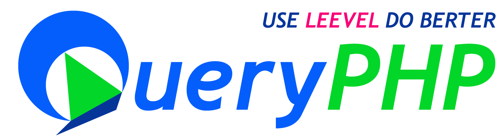
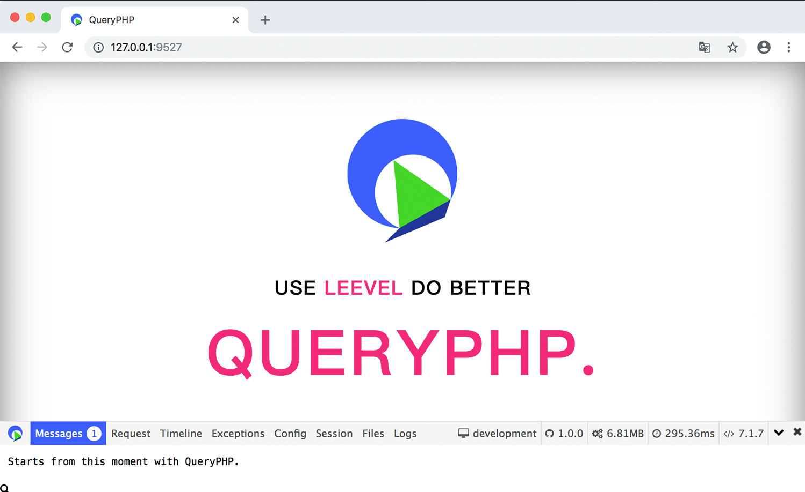
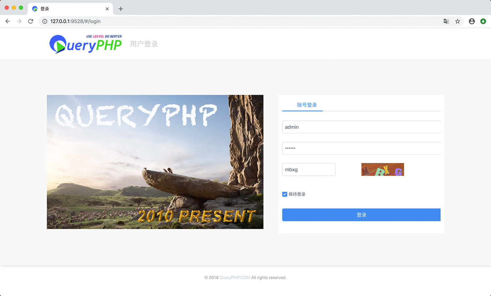
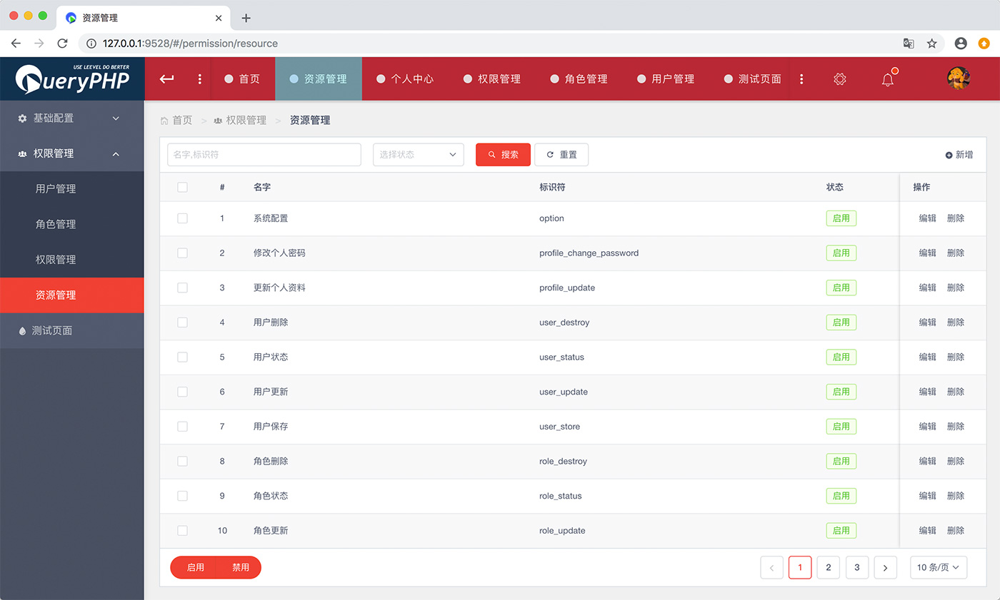

<p align="center">
  <a href="https://github.styleci.io/repos/78216574"></a>
  <a href="https://travis-ci.org/hunzhiwange/queryphp">
    </a>
  <a href='https://coveralls.io/github/hunzhiwange/queryphp?branch=master'></a>
  <a href='https://coveralls.io/github/hunzhiwange/framework?branch=master'></a>
  <a href="https://github.com/hunzhiwange/queryphp/releases">
    </a>
  <a href="http://opensource.org/licenses/MIT">
    </a>
</p>

<p align="center">
    <a href="./README.md">English</a> | <a href="./README-zh-CN.md">中文</a>
</p>

# 渐进式 PHP 常驻框架引擎

> 这是 QueryPHP 应用部分，核心框架可以在这里找到 [Framework](https://github.com/hunzhiwange/framework)。

QueryPHP 是一款现代化的高性能 PHP 7 常驻框架，以工程师用户体验为历史使命，让每一个 PHP 应用都有一个好框架。

百分之百单元测试覆盖直面 Bug 一剑封喉，基于 Zephir 实现框架常驻，依托 Swoole 生态实现业务常驻，此刻未来逐步渐进。 我们的愿景是 **<span style="color:#e82e7d;">USE LEEVEL WITH SWOOLE DO BETTER</span>**, 让您的业务撑起更多的用户服务。

*代码如诗，自由如风, 此刻携手 QueryPHP 共创美好.*

* 官方网站: <https://www.queryphp.com/>
* API 文档: <https://api.queryphp.com>
* 开发文档: <https://www.queryphp.com/docs/>

## 核心包

 * QueryPHP On Github: <https://github.com/hunzhiwange/queryphp/>
 * QueryPHP On Gitee: <https://gitee.com/dyhb/queryphp/>
 * Framework On Github: <https://github.com/hunzhiwange/framework/>
 * Framework On Gitee: <https://gitee.com/dyhb/framework/>
 * Leevel On Github: <https://github.com/hunzhiwange/leevel/>
 * Leevel On Gitee: <https://gitee.com/dyhb/leevel>
 * Tests: <https://github.com/leevels/tests/>
 * Packages: <https://github.com/leevels/>
 * Packages From Hunzhiwange: <https://packagist.org/packages/hunzhiwange/>
 * Packages From Leevel: <https://packagist.org/packages/leevel/>

## 如何安装

## 基本使用

```
composer create-project hunzhiwange/queryphp myapp dev-master
```

## 打开浏览器访问



```
php leevel server <Visite http://127.0.0.1:9527/>
```

 * 首页 <http://127.0.0.1:9527/>
 * Mvc 路由 <http://127.0.0.1:9527/api/test>
 * Mvc restful 路由 http://127.0.0.1:9527/restful/123
 * 指定方法的 Mvc restful 路由 http://127.0.0.1:9527/restful/123/show
 * 注解路由 http://127.0.0.1:9527/api/v1/petLeevelForApi/helloworld
 * 带有绑定的注解路由 http://127.0.0.1:9527/api/v2/withBind/foobar
 * php leevel link:public <http://127.0.0.1:9527/public/css/page.css>
 * php leevel link:storage <http://127.0.0.1:9527/storage/logo.png>
 * php leevel link:apis <http://127.0.0.1:9527/apis/>
 * php leevel link:debugbar <http://127.0.0.1:9527/debugbar/debugbar.css>

## 连接数据库

### 首先创建一个数据库.

```
CREATE DATABASE IF NOT EXISTS myapp DEFAULT CHARSET utf8 COLLATE utf8_general_ci;
```

### 修改 .env

```
vim .env

...
// Database
DATABASE_DRIVER = mysql
DATABASE_HOST = 127.0.0.1
DATABASE_PORT = 3306
DATABASE_NAME = queryphp_development_db
DATABASE_USER = root
DATABASE_PASSWORD =
...

to

...
// Database
DATABASE_DRIVER = mysql
DATABASE_HOST = 127.0.0.1
DATABASE_PORT = 3306
DATABASE_NAME = myapp
DATABASE_USER = root
DATABASE_PASSWORD = 123456
...

```

### 执行数据库迁移命令

```
php leevel migrate:migrate
php leevel server
```

### 测试连接数据库

<http://127.0.0.1:9527/api/entity>

```
{
 count: 4,
 :trace: {
     ...
 }
}
```

## 登陆到 QueryVue 后台

### 安装前端

第一步安装前端,细节信息可以在 `frontend/README.md` 查看.

```
cd frontend
npm install -g cnpm --registry=https://registry.npm.taobao.org // Just once
cnpm install
npm run serve # npm run dev
```

### 登陆后台

接着访问这个登陆地址. <http://127.0.0.1:9528/#/login>



```
user: admin
password: 123456
```

### 后台首页


### 红色主题的资源列表



## 运行测试

### 首先创建一个用于测试的数据库 test.

```
CREATE DATABASE IF NOT EXISTS test DEFAULT CHARSET utf8 COLLATE utf8_general_ci;
```

### 修改 .testing

```
vim .testing

...
// Database
DATABASE_DRIVER = mysql
DATABASE_HOST = 127.0.0.1
DATABASE_PORT = 3306
DATABASE_NAME = test
DATABASE_USER = root
DATABASE_PASSWORD =
...

to

...
// Database
DATABASE_DRIVER = mysql
DATABASE_HOST = 127.0.0.1
DATABASE_PORT = 3306
DATABASE_NAME = test
DATABASE_USER = root
DATABASE_PASSWORD = 123456
...

```

### 执行数据库迁移命令

```
php leevel migrate:migrate -e testing
```

### 运行

```
_____________                           _______________
 ______/     \__  _____  ____  ______  / /_  _________
  ____/ __   / / / / _ \/ __`\/ / __ \/ __ \/ __ \___
   __/ / /  / /_/ /  __/ /  \  / /_/ / / / / /_/ /__
     \_\ \_/\____/\___/_/   / / .___/_/ /_/ .___/
        \_\                /_/_/         /_/

$cd /data/codes/queryphp/
$vim .testing # modify database redis and other
$php leevel migrate:migrate -e testing
$php vendor/bin/phpunit tests
```

## 基本优化

### 关闭调试

修改 .env 或者 runtime/bootstrap/option.php.

```
// Environment production、testing and development
ENVIRONMENT = production

// Debug
DEBUG = false
```

### 执行优化指令

下面的指令可以让 QueryPHP 运行得更加快速。

```
php leevel router:cache
php leevel option:cache
php leevel i18n:cache
php leevel view:cache
php leevel autoload (contains `composer dump-autoload --optimize`)
```

或者

```
php leevel production # `php leevel development` will back.
```

## 安装 Leevel 扩展让性能更好

### Windows

后续会提供 dll 扩展.

### Linux

从下面的仓库下载源代码.

```
git clone git@github.com:hunzhiwange/leevel.git
cd ext
```


GCC 编译源码.

```
$/path/to/phpize
$./configure --with-php-config=/path/to/php-config
$make && make install
```

将扩展添加到你的 php.ini, 使用 php -m 查看扩展是否被安装.

```
extension = leevel.so
```

## 使用 swoole 提升性能

Swoole 后续会逐步提供支持.

```
php leevel swoole:http
```

## 统一团队代码风格

### 安装 PHP 代码格式化工具

<https://github.com/friendsofphp/php-cs-fixer>

### 基本使用

```
$cd /data/codes/queryphp
$php-cs-fixer fix --config=.php_cs.dist
```

### 使用 Git 钩子

添加一个 pre-commit 钩子.

```
ln -s ./build/pre-commit.sh ./.git/hooks/pre-commit
```

跳过钩子

```
# git commit -h
# git commit -n -m 'pass hook' #bypass pre-commit and commit-msg hooks
```

## 致谢

感谢同事 [毛飞](https://github.com/maosea0125) 在开发这个项目过程中的无私帮助，让我有了很多新的认识, 这让 QueryPHP 变得更加的美好.

也非常感谢下面的这些优秀的开源软件, 我们也参考了很多的设计与思想, 让我们可以站在巨人的肩膀上保持创新.

 * QeePHP: <https://github.com/dualface/qeephp2_x/>
 * Swoole: <https://github.com/swoole/>
 * JeCat: <https://github.com/JeCat/>
 * ThinkPHP: <https://github.com/top-think/>
 * Laravel: <https://github.com/laravel/>
 * Symfony: <https://github.com/symfony/>
 * Doctrine: <https://github.com/doctrine/>
 * Phalcon: <https://github.com/phalcon/>

## 版权协议

QueryPHP 是一个基于 [MIT license](http://opensource.org/licenses/MIT) 授权许可协议的开源软件.
