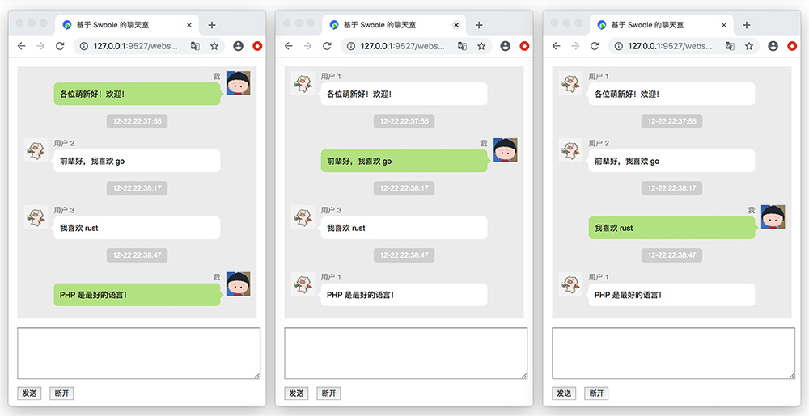

<p align="center">
  <a href="https://github.styleci.io/repos/78216574"></a>
  <a href="https://travis-ci.org/hunzhiwange/queryphp">
    </a>
  <a href='https://coveralls.io/github/hunzhiwange/queryphp?branch=master'></a>
  <a href='https://coveralls.io/github/hunzhiwange/framework?branch=master'></a>
  <a href="https://github.com/hunzhiwange/queryphp/releases">
    </a>
  <a href="http://opensource.org/licenses/MIT">
    </a>
</p>

<p align="center">
    <a href="./README.md">English</a> | <a href="./README-zh-CN.md">中文</a>
</p>

# The QueryPHP Application

> This is the QueryPHP application, the core framework can be found here [Framework](https://github.com/hunzhiwange/framework).

QueryPHP is a modern, high performance PHP 7 resident framework, with engineer user experience as its historical mission, let every PHP application have a good framework.

A hundred percent coverage of the unit tests to facing the bug,based on Zephir implemented framework resident,with Swoole ecology to achieve business resident,
now or in the future step by step. Our vision is **<span style="color:#e82e7d;">USE LEEVEL WITH SWOOLE DO BETTER</span>**, let your business to support more user services.

*The PHP Framework For Code Poem As Free As Wind, Starts From This Moment With QueryPHP.*

* Site: <https://www.queryphp.com/>
* API: <https://api.queryphp.com>
* Document: <https://www.queryphp.com/docs/>

## The core packages

 * QueryPHP On Github: <https://github.com/hunzhiwange/queryphp/>
 * QueryPHP On Gitee: <https://gitee.com/dyhb/queryphp/>
 * Framework On Github: <https://github.com/hunzhiwange/framework/>
 * Framework On Gitee: <https://gitee.com/dyhb/framework/>
 * Leevel On Github: <https://github.com/hunzhiwange/leevel/>
 * Leevel On Gitee: <https://gitee.com/dyhb/leevel>
 * Tests: <https://github.com/leevels/tests/>
 * Packages: <https://github.com/leevels/>
 * Packages From Hunzhiwange: <https://packagist.org/packages/hunzhiwange/>
 * Packages From Leevel: <https://packagist.org/packages/leevel/>

## How to install

## Base use

```
composer create-project hunzhiwange/queryphp myapp dev-master
```

## Visite it


```
php leevel server <Visite http://127.0.0.1:9527/>
```

 * Home <http://127.0.0.1:9527/>
 * Mvc router <http://127.0.0.1:9527/api/test>
 * Mvc restful router http://127.0.0.1:9527/restful/123
 * Mvc restful router with method http://127.0.0.1:9527/restful/123/show
 * Annotation router http://127.0.0.1:9527/api/v1/petLeevelForApi/helloworld
 * Annotation router with bind http://127.0.0.1:9527/api/v2/withBind/foobar
 * php leevel link:public <http://127.0.0.1:9527/public/css/page.css>
 * php leevel link:storage <http://127.0.0.1:9527/storage/logo.png>
 * php leevel link:apis <http://127.0.0.1:9527/apis/>
 * php leevel link:debugbar <http://127.0.0.1:9527/debugbar/debugbar.css>

## Connect database

### First to create a database.

```
CREATE DATABASE IF NOT EXISTS myapp DEFAULT CHARSET utf8 COLLATE utf8_general_ci;
```

### Then modify .env

```
vim .env

...
// Database
DATABASE_DRIVER = mysql
DATABASE_HOST = 127.0.0.1
DATABASE_PORT = 3306
DATABASE_NAME = queryphp_development_db
DATABASE_USER = root
DATABASE_PASSWORD =
...

to

...
// Database
DATABASE_DRIVER = mysql
DATABASE_HOST = 127.0.0.1
DATABASE_PORT = 3306
DATABASE_NAME = myapp
DATABASE_USER = root
DATABASE_PASSWORD = 123456
...

```

### Migrate

```
php leevel migrate:migrate
php leevel server
```

### Test with database

<http://127.0.0.1:9527/api/entity>

```
{
    count: 4,
    :trace: {
        ...
    }
}
```

## Login to QueryVue

### Install frontend

First to install the frontend,see more detail on `frontend/README.md`.

```
cd frontend
npm install -g cnpm --registry=https://registry.npm.taobao.org // Just once
cnpm install
npm run serve # npm run dev
```

### Login

Then visite it. <http://127.0.0.1:9528/#/login>


```
user: admin
password: 123456
```

### Home


### Resource list with red theme


## Run Tests

### First to create a test database.

```
CREATE DATABASE IF NOT EXISTS test DEFAULT CHARSET utf8 COLLATE utf8_general_ci;
```

### Then modify .testing

```
vim .testing

...
// Database
DATABASE_DRIVER = mysql
DATABASE_HOST = 127.0.0.1
DATABASE_PORT = 3306
DATABASE_NAME = test
DATABASE_USER = root
DATABASE_PASSWORD =
...

to

...
// Database
DATABASE_DRIVER = mysql
DATABASE_HOST = 127.0.0.1
DATABASE_PORT = 3306
DATABASE_NAME = test
DATABASE_USER = root
DATABASE_PASSWORD = 123456
...

```

### Migrate

```
php leevel migrate:migrate -e testing
```

### Run

```
_____________                           _______________
 ______/     \__  _____  ____  ______  / /_  _________
  ____/ __   / / / / _ \/ __`\/ / __ \/ __ \/ __ \___
   __/ / /  / /_/ /  __/ /  \  / /_/ / / / / /_/ /__
     \_\ \_/\____/\___/_/   / / .___/_/ /_/ .___/
        \_\                /_/_/         /_/

$cd /data/codes/queryphp/
$vim .testing # modify database redis and other
$php leevel migrate:migrate -e testing
$php vendor/bin/phpunit tests
```

## Base optimization

### Debug

Modify .env or runtime/bootstrap/option.php.

```
// Environment production、testing and development
ENVIRONMENT = production

// Debug
DEBUG = false
```

### Commands

The commands below can make queryphp faster.

```
php leevel router:cache
php leevel option:cache
php leevel i18n:cache
php leevel view:cache
php leevel autoload (contains `composer dump-autoload --optimize`)
```

Or

```
php leevel production # `php leevel development` will back.
```

## USE LEEVEL DO BETTER

### Windows

Need to tests.

### Linux

You can download the source code.

```
git clone git@github.com:hunzhiwange/leevel.git
cd ext
```


Then compile it.

```
$/path/to/phpize
$./configure --with-php-config=/path/to/php-config
$make && make install
```

Then add extension to your php.ini,you can see if installation is successful by command php -m.

```
extension = leevel.so
```

## Use Swoole With Ultra High Performance

### Http server

```
php leevel http:server # php leevel http:server -d
php leevel http:reload
php leevel http:stop
php leevel http:status
```

The same with php-fpm

```
root@vagrant-ubuntu-10-0-2-5:/data/codes/queryphp# php leevel http:server
_____________                           _______________
 ______/     \__  _____  ____  ______  / /_  _________
  ____/ __   / / / / _ \/ __`\/ / __ \/ __ \/ __ \___
   __/ / /  / /_/ /  __/ /  \  / /_/ / / / / /_/ /__
     \_\ \_/\____/\___/_/   / / .___/_/ /_/ .___/
        \_\                /_/_/         /_/
Http Server Version 1.0.0

+-----------------------+---------------------------------+
| Item                  | Value                           |
+-----------------------+---------------------------------+
| host                  | 0.0.0.0                         |
| port                  | 9501                            |
| process_name          | leevel.http                     |
| pid_path              | @path/runtime/protocol/http.pid |
| worker_num            | 8                               |
| daemonize             | 0                               |
| enable_static_handler | 1                               |
| document_root         | @path/www                       |
| task_worker_num       | 4                               |
+-----------------------+---------------------------------+
```

 * Home http://127.0.0.1:9501/
 * Mvc router http://127.0.0.1:9501/api/test
 * Mvc restful router http://127.0.0.1:9501/restful/123
 * Mvc restful router with method http://127.0.0.1:9501/restful/123/show
 * Annotation router http://127.0.0.1:9501/api/v1/petLeevelForApi/helloworld
 * Annotation router with bind http://127.0.0.1:9501/api/v2/withBind/foobar
 * php leevel link:public http://127.0.0.1:9501/public/css/page.css
 * php leevel link:storage http://127.0.0.1:9501/storage/logo.png
 * php leevel link:apis http://127.0.0.1:9501/apis/
 * php leevel link:debugbar http://127.0.0.1:9501/debugbar/debugbar.css

### Websocket server

```
php leevel websocket:server # php leevel websocket:server -d
php leevel websocket:reload
php leevel websocket:stop
php leevel websocket:status
```

A chat room demo

```
root@vagrant-ubuntu-10-0-2-5:/data/codes/queryphp# php leevel websocket:server
_____________                           _______________
 ______/     \__  _____  ____  ______  / /_  _________
  ____/ __   / / / / _ \/ __`\/ / __ \/ __ \/ __ \___
   __/ / /  / /_/ /  __/ /  \  / /_/ / / / / /_/ /__
     \_\ \_/\____/\___/_/   / / .___/_/ /_/ .___/
        \_\                /_/_/         /_/
Websocket Server Version 1.0.0

+-----------------+--------------------------------------+
| Item            | Value                                |
+-----------------+--------------------------------------+
| host            | 0.0.0.0                              |
| port            | 9502                                 |
| process_name    | leevel.websocket                     |
| pid_path        | @path/runtime/protocol/websocket.pid |
| worker_num      | 8                                    |
| daemonize       | 0                                    |
| task_worker_num | 4                                    |
+-----------------+--------------------------------------+
```

Visite <http://127.0.0.1:9527/websocket/chat>



### Rpc server

```
php leevel rpc:server # php leevel rpc:server -d
php leevel rpc:reload
php leevel rpc:stop
php leevel rpc:status
```

Rpc thrift protocol

[Leevel/Protocol/Thrift/Struct/leevel.thrift](https://github.com/hunzhiwange/framework/blob/master/src/Leevel/Protocol/Thrift/Struct/leevel.thrift)

```
namespace php Leevel.Protocol.Thrift.Service

/**
 * ---------------------------------------------------------------
 * 定义一个请求包结构
 * ---------------------------------------------------------------
 *
 * 约定请求数据包，方便只定义一个结构全自动调用 MVC 服务
 */
struct Request
{
  // call 为字符串类型，是指 Service 接口的名称
  // 例如：home:blog/info@get 为调用 mvc 接口中的数据
  1: required string call;

  // params 为 list 类型数据，一个元素可重复的有序列表，C++ 之 vector，Java 之 ArrayList，PHP 之 array
  2: list<string> params;

  // 服务端客户端共享自定义共享数据
  // 相当于 PHP 中的关联数组
  3: map<string,string> metas;
}

/**
 * ---------------------------------------------------------------
 * 定义一个响应包结构
 * ---------------------------------------------------------------
 *
 * 通用响应接口，数据以 JSON 进行交互
 */
struct Response
{
  // status 为响应状态，200 表示成功，其他参考 HTTP 状态
  1: required i16 status;

  // code 为 JSON 字符串，客户端自主进行解析
  2: required string data;
}

/**
 * ---------------------------------------------------------------
 * 定义一个通用的服务
 * ---------------------------------------------------------------
 *
 * 通用调用服务，通过一个 call
 */
service Thrift
{
    Response call(1: Request request)
}
```

A rpc demo

```
root@vagrant-ubuntu-10-0-2-5:/data/codes/queryphp# php leevel rpc:server
_____________                           _______________
 ______/     \__  _____  ____  ______  / /_  _________
  ____/ __   / / / / _ \/ __`\/ / __ \/ __ \/ __ \___
   __/ / /  / /_/ /  __/ /  \  / /_/ / / / / /_/ /__
     \_\ \_/\____/\___/_/   / / .___/_/ /_/ .___/
        \_\                /_/_/         /_/
Rpc Server Version 1.0.0

+-----------------------+--------------------------------+
| Item                  | Value                          |
+-----------------------+--------------------------------+
| host                  | 0.0.0.0                        |
| port                  | 1355                           |
| process_name          | leevel.rpc                     |
| pid_path              | @path/runtime/protocol/rpc.pid |
| worker_num            | 8                              |
| daemonize             | 0                              |
| dispatch_mode         | 1                              |
| open_length_check     | 1                              |
| package_max_length    | 8192000                        |
| package_length_type   | N                              |
| package_length_offset | 0                              |
| package_body_offset   | 4                              |
| task_worker_num       | 4                              |
+-----------------------+--------------------------------+
```

Visite <http://127.0.0.1:9527/api/rpc>

``` php
<?php

declare(strict_types=1);

/*
 * This file is part of the forcodepoem package.
 *
 * The PHP Application Created By Code Poem. <Query Yet Simple>
 * (c) 2018-2099 http://forcodepoem.com All rights reserved.
 *
 * For the full copyright and license information, please view the LICENSE
 * file that was distributed with this source code.
 */

namespace App\App\Controller\Api;

use Leevel\Http\IResponse;
use Leevel\Protocol\Facade\Rpc as Rpcs;

/**
 * rpc tests.
 *
 * @author Name Your <your@mail.com>
 *
 * @since 2018.08.31
 *
 * @version 1.0
 */
class Rpc
{
    /**
     * 默认方法.
     *
     * @return \Leevel\Http\IResponse
     */
    public function handle(): IResponse
    {
        return Rpcs::call('api/rpc/rpc-result', ['foo', 'bar'], ['arg1' => 'hello', 'arg2' => 'world']);
    }

    /**
     * RPC 结果.
     *
     * @return array
     */
    public function rpcResult(string $arg1, string $arg2, array $metas): array
    {
        return ['arg1' => $arg1, 'arg2' => $arg2, 'metas' => $metas];
    }
}

// The result
// {"arg1":"foo","arg2":"bar","metas":{"arg1":"hello","arg2":"world"}}
```

## Unified Code Style

### Install PHP Coding Standards Fixer

<https://github.com/friendsofphp/php-cs-fixer>

### Base use

```
$cd /data/codes/queryphp
$php-cs-fixer fix --config=.php_cs.dist
```

### With Git hooks

Add a pre-commit for it.

```
cp ./build/pre-commit.sh ./.git/hooks/pre-commit
chmod 777 ./.git/hooks/pre-commit
```

Pass hook

```
# git commit -h
# git commit -n -m 'pass hook' #bypass pre-commit and commit-msg hooks
```

## Thanks

Thanks my colleague [John.mao](https://github.com/maosea0125) for your selfless help in the development of this project and and let me have a new understanding, it makes QueryPHP more beautiful.

Thanks for these excellent projects, we have absorbed a lot of excellent design and ideas, standing on the shoulders of giants for innovation.

 * QeePHP: <https://github.com/dualface/qeephp2_x/>
 * Swoole: <https://github.com/swoole/>
 * JeCat: <https://github.com/JeCat/>
 * ThinkPHP: <https://github.com/top-think/>
 * Laravel: <https://github.com/laravel/>
 * Symfony: <https://github.com/symfony/>
 * Doctrine: <https://github.com/doctrine/>
 * Phalcon: <https://github.com/phalcon/>

## License

The QueryPHP framework is open-sourced software licensed under the [MIT license](http://opensource.org/licenses/MIT).
