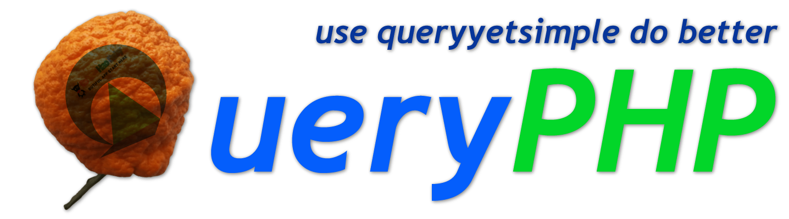
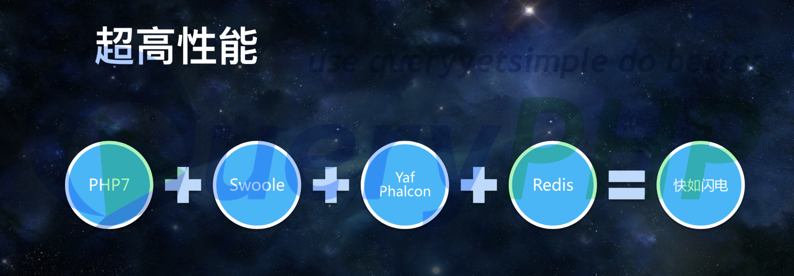

<p align="center">
  <a href="https://github.com/hunzhiwange/queryphp/releases">
    </a>
  <a href="https://travis-ci.org/hunzhiwange/queryphp">
    </a>
  <a href="https://secure.php.net/">
    </a>
  <a href="http://opensource.org/licenses/MIT">
    </a>
</p>


# The QueryPHP Application

QueryPHP is a powerful PHP framework for code poem as free as wind. [Query Yet Simple]

QueryPHP was founded in 2010 and released the first version on 2010.10.03.

QueryPHP was based on the DoYouHaoBaby framework，we have a large code refactoring.


<p>DoYouHaoBaby has a lot of features: MVC, ActiveRecord, i18n, cache, databases, template engine, RBAC, and so on.</p>

<p>DoYouHaoBaby released 0.0.1 version at 2010/10/03, the last version was released in 2014/10 version 3, and now it has stopped maintenance.</p>

## Optional C Extension

<p>
  <a href="https://github.com/hunzhiwange/queryyetsimple">
    </a>
  <a href="http://pecl.php.net/package/swoole">
    </a>
  <a href="https://github.com/apache/thrift/tree/master/lib/php">
    </a>
  <a href="http://pecl.php.net/package/inotify">
    </a>
  <a href="http://pecl.php.net/package/v8js">
    </a>
</p>



<a href="https://github.com/ThinkDevelopers/PHPConChina/blob/master/PHPCON2016/PHP7%2BSwoole%E5%BC%80%E5%8F%91%E8%B6%85%E9%AB%98%E6%80%A7%E8%83%BD%E5%90%8E%E5%8F%B0%E7%A8%8B%E5%BA%8F--%E9%9F%A9%E5%A4%A9%E5%B3%B0%40PHPCon2016.pdf" target="_blank">@PHP7+Swoole开发超高性能后台程序--韩天峰@PHPCon2016.pdf</a>

We think the performance of PHP applications is very important and the development of pleasure also needs to be considered, and that's why we have developed the QueryPHP framework to achieve great ideals.

* PHP 7 - We choose the lowest version of 7.1.3, because php7 has a unique advantage over the earlier version.
* QueryYet - We provides an optional c extension to takeover core components of the framework,such as IOC, log, cache.
* Redis - QueryPHP encapsulation a cache component, including files, redis, memcache and so on, so as to reduce the pressure of database.

```
Wow! Cool! Query Yet Simple!
```

## How to install

```
composer create-project hunzhiwange/queryphp myapp
```

## Query Yet Simple To Do Right Things

It is index.php.

```
<?php
/**
 * _____________                           _______________
 *  ______/     \__  _____  ____  ______  / /_  _________
 *   ____/ __   / / / / _ \/ __`\/ / __ \/ __ \/ __ \___
 *    __/ / /  / /_/ /  __/ /  \  / /_/ / / / / /_/ /__
 *      \_\ \_/\____/\___/_/   / / .___/_/ /_/ .___/
 *         \_\                /_/_/         /_/
 *
 * (c) 2010-2018 http://queryphp.com All rights reserved.
 */

version_compare(PHP_VERSION, '7.1.3', '<') && die('PHP 7.1.3 OR Higher');

$composer = require_once dirname(__DIR__) . '/vendor/autoload.php';
Queryyetsimple\Bootstrap\Project::singletons($composer);
```

## Official Documentation

Documentation for the framework can be found on the [QueryPHP website](http://www.queryphp.com).

## License

The QueryPHP framework is open-sourced software licensed under the [MIT license](http://opensource.org/licenses/MIT).
