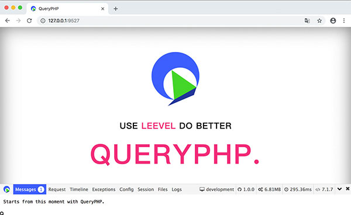

<p align="center">
  <a href="https://github.styleci.io/repos/78216574"></a>
  <a href="https://travis-ci.org/hunzhiwange/queryphp">
    </a>
  <a href='https://coveralls.io/github/hunzhiwange/queryphp?branch=master'></a>
  <a href='https://coveralls.io/github/hunzhiwange/framework?branch=master'></a>
  <a href="https://github.com/hunzhiwange/queryphp/releases">
    </a>
  <a href="http://opensource.org/licenses/MIT">
    </a>
</p>

<p align="center">
    <a href="./README.md">English</a> | <a href="./README-zh-CN.md">中文</a>
</p>

# The QueryPHP Application

QueryPHP is a modern, high performance PHP 7 resident framework, with engineer user experience as its historical mission, let every PHP application have a good framework.

A hundred percent coverage of the unit tests to facing the bug,based on Zephir implemented framework resident,with Swoole ecology to achieve business resident,
now or in the future step by step. Our vision is **<span style="color:#e82e7d;">USE LEEVEL WITH SWOOLE DO BETTER</span>**, let your business to support more user services.

*The PHP Framework For Code Poem As Free As Wind, Starts From This Moment With QueryPHP.*

* Site: <https://www.queryphp.com/>
* API: <https://api.queryphp.com>
* Document: <https://www.queryphp.com/docs/>

## The core packages

 * QueryPHP On Github: <https://github.com/hunzhiwange/queryphp/>
 * QueryPHP On Gitee: <https://gitee.com/dyhb/queryphp/>
 * Framework On Github: <https://github.com/hunzhiwange/framework/>
 * Framework On Gitee: <https://gitee.com/dyhb/framework/>
 * Leevel On Github: <https://github.com/hunzhiwange/leevel/>
 * Leevel On Gitee: <https://gitee.com/dyhb/leevel>
 * Tests: <https://github.com/leevels/tests/>
 * Packages: <https://github.com/leevels/>
 * Packages From Hunzhiwange: <https://packagist.org/packages/hunzhiwange/>
 * Packages From Leevel: <https://packagist.org/packages/leevel/>

## How to install

## Base use

```
composer create-project hunzhiwange/queryphp myapp dev-master
```

## Visite it


```
php leevel server <Visite http://127.0.0.1:9527/>
```

 * Home <http://127.0.0.1:9527/>
 * Mvc router <http://127.0.0.1:9527/api/test>
 * Mvc restful router http://127.0.0.1:9527/restful/123
 * Mvc restful router with method http://127.0.0.1:9527/restful/123/show
 * Annotation router http://127.0.0.1:9527/api/v1/petLeevelForApi/helloworld
 * Annotation router with bind http://127.0.0.1:9527/api/v2/withBind/foobar
 * php leevel link:public <http://127.0.0.1:9527/public/css/page.css>
 * php leevel link:storage <http://127.0.0.1:9527/storage/logo.png>
 * php leevel link:apis <http://127.0.0.1:9527/apis/>
 * php leevel link:debugbar <http://127.0.0.1:9527/debugbar/debugbar.css>

## Connect database

### First to create a database.

```
CREATE DATABASE IF NOT EXISTS myapp DEFAULT CHARSET utf8 COLLATE utf8_general_ci;
```

### Then modify .env

```
vim .env

...
// Database
DATABASE_DRIVER = mysql
DATABASE_HOST = 127.0.0.1
DATABASE_PORT = 3306
DATABASE_NAME = queryphp_development_db
DATABASE_USER = root
DATABASE_PASSWORD =
...

to

...
// Database
DATABASE_DRIVER = mysql
DATABASE_HOST = 127.0.0.1
DATABASE_PORT = 3306
DATABASE_NAME = myapp
DATABASE_USER = root
DATABASE_PASSWORD = 123456
...

```

### Migrate

```
php leevel migrate:migrate
php leevel server
```

### Test with database

<http://127.0.0.1:9527/api/entity>

```
{
    count: 4,
    :trace: {
        ...
    }
}
```

## Login to QueryVue

### Install frontend

First to install the frontend,see more detail on `frontend/README.md`.

```
cd frontend
npm install -g cnpm --registry=https://registry.npm.taobao.org // Just once
cnpm install
npm run serve # npm run dev
```

### Login

Then visite it. <http://127.0.0.1:9528/#/login>


```
user: admin
password: 123456
```

### Home



### Resource list with red theme


## Run Tests

### First to create a test database.

```
CREATE DATABASE IF NOT EXISTS test DEFAULT CHARSET utf8 COLLATE utf8_general_ci;
```

### Then modify .testing

```
vim .testing

...
// Database
DATABASE_DRIVER = mysql
DATABASE_HOST = 127.0.0.1
DATABASE_PORT = 3306
DATABASE_NAME = test
DATABASE_USER = root
DATABASE_PASSWORD =
...

to

...
// Database
DATABASE_DRIVER = mysql
DATABASE_HOST = 127.0.0.1
DATABASE_PORT = 3306
DATABASE_NAME = test
DATABASE_USER = root
DATABASE_PASSWORD = 123456
...

```

### Migrate

```
php leevel migrate:migrate -e testing
```

### Run

```
_____________                           _______________
 ______/     \__  _____  ____  ______  / /_  _________
  ____/ __   / / / / _ \/ __`\/ / __ \/ __ \/ __ \___
   __/ / /  / /_/ /  __/ /  \  / /_/ / / / / /_/ /__
     \_\ \_/\____/\___/_/   / / .___/_/ /_/ .___/
        \_\                /_/_/         /_/

$cd /data/codes/queryphp/
$vim .testing # modify database redis and other
$php leevel migrate:migrate -e testing
$php vendor/bin/phpunit tests
```

## Base optimization

### Debug

Modify .env or runtime/bootstrap/option.php.

```
// Environment production、testing and development
ENVIRONMENT = production

// Debug
DEBUG = false
```

### Commands

The commands below can make queryphp faster.

```
php leevel router:cache
php leevel option:cache
php leevel i18n:cache
php leevel view:cache
php leevel autoload (contains `composer dump-autoload --optimize`)
```

Or

```
php leevel production # `php leevel development` will back.
```

## USE LEEVEL DO BETTER

### Windows

Need to tests.

### Linux

You can download the source code.

```
git clone git@github.com:hunzhiwange/leevel.git
cd ext
```


Then compile it.

```
$/path/to/phpize
$./configure --with-php-config=/path/to/php-config
$make && make install
```

Then add extension to your php.ini,you can see if installation is successful by command php -m.

```
extension = leevel.so
```

## Use Swoole With Ultra High Performance

This will coming back later.

```
php leevel swoole:http
```

## Unified Code Style

### Install PHP Coding Standards Fixer

<https://github.com/friendsofphp/php-cs-fixer>

### Base use

```
$cd /data/codes/queryphp
$php-cs-fixer fix --config=.php_cs.dist
```

### With Git hooks

Add a pre-commit for it.

```
ln -s ./build/pre-commit.sh ./.git/hooks/pre-commit
```

Pass hook

```
# git commit -h
# git commit -n -m 'pass hook' #bypass pre-commit and commit-msg hooks
```

## Thanks

Thanks my colleague [John.mao](https://github.com/maosea0125) for your selfless help in the development of this project and and let me have a new understanding, it makes QueryPHP more beautiful.

Thanks for these excellent projects, we have absorbed a lot of excellent design and ideas, standing on the shoulders of giants for innovation.

 * QeePHP: <https://github.com/dualface/qeephp2_x/>
 * Swoole: <https://github.com/swoole/>
 * JeCat: <https://github.com/JeCat/>
 * ThinkPHP: <https://github.com/top-think/>
 * Laravel: <https://github.com/laravel/>
 * Symfony: <https://github.com/symfony/>
 * Doctrine: <https://github.com/doctrine/>
 * Phalcon: <https://github.com/phalcon/>

## License

The QueryPHP framework is open-sourced software licensed under the [MIT license](http://opensource.org/licenses/MIT).
