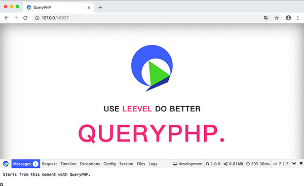

```
_____________                           _______________
 ______/     \__  _____  ____  ______  / /_  _________
  ____/ __   / / / / _ \/ __`\/ / __ \/ __ \/ __ \___
   __/ / /  / /_/ /  __/ /  \  / /_/ / / / / /_/ /__
     \_\ \_/\____/\___/_/   / / .___/_/ /_/ .___/
        \_\                /_/_/         /_/
```

<p align="center">
    <a href="./MORE.md">English</a> | <a href="./MORE-zh-CN.md">中文</a>
</p>

## 如何安装

## 基本使用

```
composer create-project hunzhiwange/queryphp myapp
```

## 打开浏览器访问



```
php leevel server <Visite http://127.0.0.1:9527/>
```

- Home http://127.0.0.1:9527/
- MVC router http://127.0.0.1:9527/api/test
- MVC restful router http://127.0.0.1:9527/restful/123
- MVC restful router with method http://127.0.0.1:9527/restful/123/show
- Annotation api router http://127.0.0.1:9527/api/v1/demo/liu
- Annotation web router http://127.0.0.1:9527/web/v2/demo
- php leevel link:static http://127.0.0.1:9527/static/css/page.css
- php leevel link:attachments http://127.0.0.1:9527/attachments/.gitignore
- php leevel link:apis http://127.0.0.1:9527/apis/
- php leevel link:debugbar http://127.0.0.1:9527/debugbar/debugbar.css

## 连接数据库

### 首先创建一个数据库.

```
CREATE DATABASE IF NOT EXISTS myapp DEFAULT CHARSET utf8 COLLATE utf8_general_ci;
```

### 修改 .env

```
vim .env

...
// Database
DATABASE_DRIVER = mysql
DATABASE_HOST = 127.0.0.1
DATABASE_PORT = 3306
DATABASE_NAME = queryphp_development_db
DATABASE_USER = root
DATABASE_PASSWORD =
...

to

...
// Database
DATABASE_DRIVER = mysql
DATABASE_HOST = 127.0.0.1
DATABASE_PORT = 3306
DATABASE_NAME = myapp
DATABASE_USER = root
DATABASE_PASSWORD = 123456
...

```

### 执行数据库迁移命令

```diff
- $php leevel migrate:migrate
+ $composer migrate
$php leevel server
```

### 测试连接数据库

<http://127.0.0.1:9527/api/entity>

```
{
 count: 4,
 :trace: {
     ...
 }
}
```

## 登陆到 QueryVue 后台

### 安装前端

前端项目 <https://github.com/hunzhiwange/queryvue>。

第一步安装前端,细节信息可以在 `README-zh-CN.md` 查看.

```
cd data/codes/queryvue/
npm install -g cnpm --registry=https://registry.npm.taobao.org // Just once
cnpm install
npm run serve # npm run dev
```

### 登陆后台

接着访问这个登陆地址. <http://127.0.0.1:9528/#/login>

```
user: admin
password: 123456
```

## 运行测试

### 首先创建一个用于测试的数据库 test.

```
CREATE DATABASE IF NOT EXISTS test DEFAULT CHARSET utf8 COLLATE utf8_general_ci;
```

### 修改 .env.phpunit

```
vim .env.phpunit

...
// Database
DATABASE_DRIVER = mysql
DATABASE_HOST = 127.0.0.1
DATABASE_PORT = 3306
DATABASE_NAME = test
DATABASE_USER = root
DATABASE_PASSWORD =
...

to

...
// Database
DATABASE_DRIVER = mysql
DATABASE_HOST = 127.0.0.1
DATABASE_PORT = 3306
DATABASE_NAME = test
DATABASE_USER = root
DATABASE_PASSWORD = 123456
...

```

### 执行数据库迁移命令

```diff
- php leevel migrate:migrate -e env.phpunit
+ $composer migrate-phpunit
```

### 运行

```diff
$cd /data/codes/queryphp/
$vim .env.phpunit # modify database redis and other
- $php leevel migrate:migrate -e env.phpunit
+ $composer migrate-phpunit
+ $php assets/build/phpunit
+ $composer test
+ $composer test-coverage
```

## 生产环境优化

### 关闭调试

修改 .env 或者 bootstrap/option.php.

```
// Environment production、testing and development
ENVIRONMENT = production

// Debug
DEBUG = false
DEBUG_JSON = false 
DEBUG_CONSOLE = false
DEBUG_JAVASCRIPT = false
```

### 执行优化指令

下面的指令可以让 QueryPHP 运行得更加快速。

```
php leevel router:cache
php leevel option:cache
php leevel i18n:cache
php leevel view:cache
php leevel autoload (Equivalent to `composer dump-autoload --optimize --no-dev`)
```

或者

```
php leevel production
```

## 开发阶段

### 打开调试

修改 .env 或者 bootstrap/option.php.

```
// Environment production、testing and development
ENVIRONMENT = development

// Debug
DEBUG = true 
DEBUG_JSON = true 
DEBUG_CONSOLE = true
DEBUG_JAVASCRIPT = true
```

### 清理缓存指令

```
php leevel i18n:clear
php leevel log:clear
php leevel option:clear
php leevel router:clear
php leevel session:clear
php leevel view:clear
php leevel autoload --dev (Equivalent to `composer dump-autoload --optimize`)
```

Or

```
php leevel development
```

## RoadRunner 支持

RoadRunner 是一个开源的高性能 PHP 应用服务器、负载均衡器和流程管理器。它支持作为一个服务运行，能够在每个项目的基础上扩展其功能。

### 安装 RoadRunner

你可以下载二进制文件.

```
cd /data/server
wget https://github.com/spiral/roadrunner/releases/download/v2.12.1/roadrunner-2.12.1-darwin-amd64.zip
unzip roadrunner-2.12.1-darwin-amd64.zip
cd /data/codes/queryphp
```

安装依赖包

```          
composer require spiral/roadrunner ^2.12.1              
composer require spiral/dumper ^2.14.1.                 
composer require symfony/psr-http-message-bridge ^2.0  
composer require nyholm/psr7 ^1.5  
```

### RoadRunner 服务

```
/data/server/roadrunner-2.12.1-darwin-amd64/rr serve
/data/server/roadrunner-2.12.1-darwin-amd64/rr http:reset
```

RoadRunner 和 php-fpm 保持一致

```
root@vagrant-ubuntu-10-0-2-5:/data/codes/queryphp# /data/server/roadrunner-2.12.1-darwin-amd64/rr serve
2022-12-10T16:43:30.226+0800	DEBUG	rpc         	plugin was started	{"address": "tcp://127.0.0.1:6001", "list of the plugins with RPC methods:": ["app", "informer", "resetter"]}
[INFO] RoadRunner server started; version: 2.12.1, buildtime: 2022-12-01T12:41:50+0000
2022-12-10T16:43:30.524+0800	DEBUG	server      	worker is allocated	{"pid": 9522, "internal_event_name": "EventWorkerConstruct"}
2022-12-10T16:43:30.524+0800	DEBUG	server      	worker is allocated	{"pid": 9525, "internal_event_name": "EventWorkerConstruct"}
2022-12-10T16:43:30.524+0800	DEBUG	server      	worker is allocated	{"pid": 9523, "internal_event_name": "EventWorkerConstruct"}
2022-12-10T16:43:30.524+0800	DEBUG	server      	worker is allocated	{"pid": 9529, "internal_event_name": "EventWorkerConstruct"}
2022-12-10T16:43:30.524+0800	DEBUG	server      	worker is allocated	{"pid": 9528, "internal_event_name": "EventWorkerConstruct"}
2022-12-10T16:43:30.524+0800	DEBUG	server      	worker is allocated	{"pid": 9526, "internal_event_name": "EventWorkerConstruct"}
2022-12-10T16:43:30.524+0800	DEBUG	server      	worker is allocated	{"pid": 9527, "internal_event_name": "EventWorkerConstruct"}
2022-12-10T16:43:30.524+0800	DEBUG	server      	worker is allocated	{"pid": 9524, "internal_event_name": "EventWorkerConstruct"}
2022-12-10T16:43:30.525+0800	DEBUG	http        	http server was started	{"address": "0.0.0.0:9527"}
2022-12-10T16:44:08.664+0800	INFO	http        	http log	{"status": 200, "method": "GET", "URI": "/", "remote_address": "127.0.0.1:56516", "read_bytes": 0, "write_bytes": 18441, "start": "2022-12-10T16:44:08.644+0800", "elapsed": "19.623241ms"}
```

## 统一团队代码风格

### 安装 PHP 代码格式化工具

<https://github.com/friendsofphp/php-cs-fixer>

不需要安装即可使用，我们已经下载了版本。

### 基本使用

```diff
$cd /data/codes/queryphp
- $php-cs-fixer fix --config=.php_cs.dist
+ $php assets/build/php-cs-fixer fix --config=.php_cs.dist
+ $composer php-cs-fixer
```

### 使用 Git 钩子

添加一个 pre-commit 钩子.

```
cp assets/build/pre-commit.sh .git/hooks/pre-commit
chmod 777 .git/hooks/pre-commit
```

跳过钩子

```
# git commit -h
# git commit -n -m 'pass hook' #bypass pre-commit and commit-msg hooks
```

## PHPStan 静态分析

```diff
- $php assets/build/phpstan analyse
+ $composer phpstan
```

## 版权协议

QueryPHP 是一个基于 [MIT license](http://opensource.org/licenses/MIT) 授权许可协议的开源软件.
